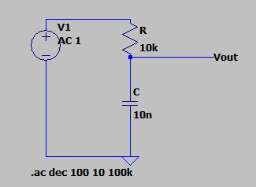
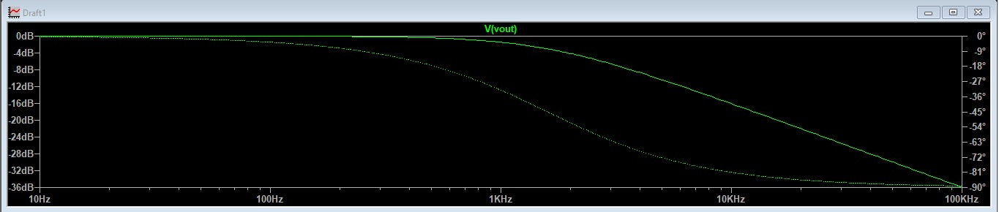

## Questão 4

Utilizando o LTspice, levante a curva de resposta em magnitude e resposta em fase para o circuito considerando **R = 10 kΩ** e **C = 10 nF**.

---

### Montagem do Circuito

Para obter a resposta em frequência do filtro passa-baixas RC, foi realizada uma simulação AC no software LTspice.

Inicialmente, foi montado o circuito utilizando os valores:

- **R = 10 kΩ**
- **C = 10 nF**

<p align="center">
<sub><b>Figura 1 – Montagem do circuito no LTspice.</b></sub>
</p>

<p align="center">

</p>

<p align="center">
<sub>Fonte: Autoria própria (2026).</sub>
</p>

A fonte de tensão foi configurada para análise AC com amplitude unitária:

```text
AC = 1
```

### Configuração da Simulação

Foi realizada uma análise AC com varredura logarítmica de frequência utilizando o comando:

```text
.ac dec 100 10 100k
```

correspondendo a uma varredura entre:

- Frequência inicial: **10 Hz**
- Frequência final: **100 kHz**

### Resultado da Simulação

Após executar a simulação, foi selecionado o nó de saída **Vout**, obtendo-se os diagramas de magnitude e fase do sistema.

<p align="center">
<sub><b>Figura 2 – Resposta em magnitude e fase do filtro passa-baixas RC.</b></sub>
</p>

<p align="center">

</p>

<p align="center">
<sub>Fonte: Autoria própria (2026).</sub>
</p>

### Frequência de Corte Teórica

A frequência de corte de um filtro RC passa-baixas é dada por:

$$
f_c=\frac{1}{2\pi RC}
$$

Substituindo os valores do circuito:

$$
f_c=\frac{1}{2\pi(10\times10^3)(10\times10^{-9})}
$$

obtém-se:

$$
f_c \approx 1591,55\;Hz
$$

ou, de forma equivalente,

$$
f_c \approx 1,59\;kHz
$$

### Análise dos Resultados

Observando o gráfico obtido no LTspice, verifica-se que:

- Para baixas frequências, o ganho permanece próximo de **0 dB**, indicando que os sinais passam praticamente sem atenuação;
- À medida que a frequência aumenta, a magnitude diminui gradativamente, comportamento característico de um filtro passa-baixas;
- Em torno da frequência de corte (**fc ≈ 1,59 kHz**), a magnitude atinge aproximadamente **−3 dB**;
- Nessa mesma frequência, a fase assume valor próximo de **−45°**;
- Para frequências elevadas, a fase tende a **−90°**.

### Conclusão

A curva de magnitude e a curva de fase obtidas na simulação confirmam o comportamento esperado de um filtro passa-baixas RC de primeira ordem, validando os resultados teóricos calculados para o circuito.