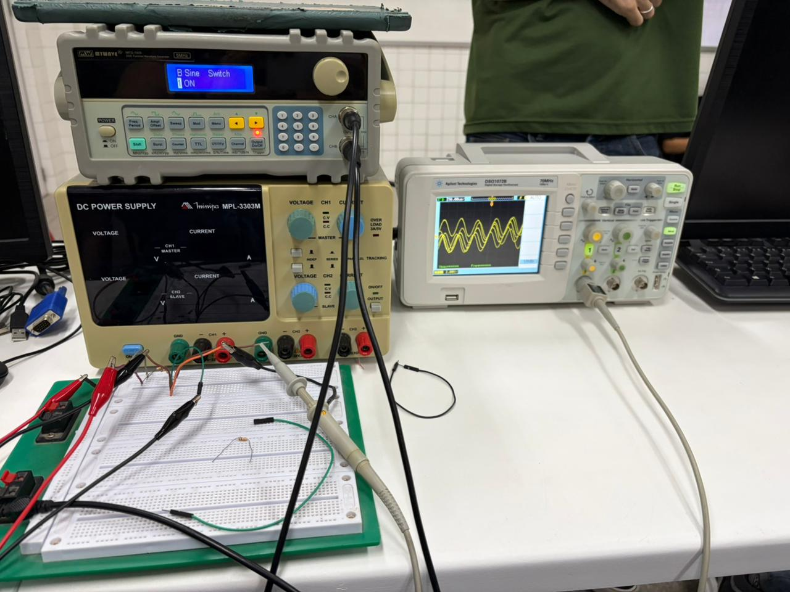
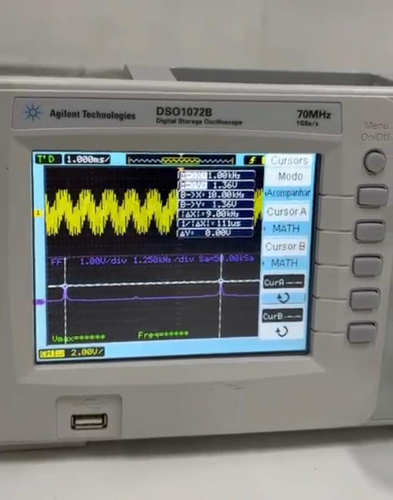
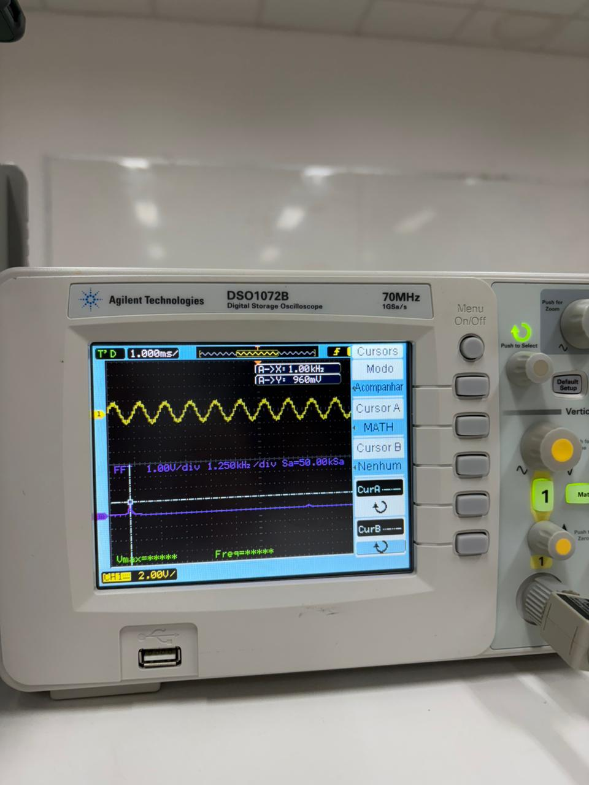

### Questão 5

Monte o filtro em Protoboard. Considere R = 10 kΩ e C = 10 nF. Aplique, na entrada do filtro, uma soma de dois sinais senoidais, o primeiro com frequência de 500 Hz e o segundo com frequência de 10 kHz, ambos com amplitude de 10V. Para realizar a soma de sinais senoidais, utilize o circuito somador resistivo apresentado na Figura 2 abaixo. Apresente, como resultados:

(i) a forma de onda após o somador resistivo;

<b>Figura 1 – Forma de onda com somador resistivo.</b>

Fonte: Autoria própria (2026).

---
(ii) o espectro de frequências após o somador resistivo;

<b>Figura 2 – Espectro de frequências.</b>

Fonte: Autoria própria (2026).

---
(iii) a forma de onda após a filtragem;

<b>Figura 3 – Onda após filtragem e espectro.</b>

Fonte: Autoria própria (2026).

(iv) o espectro de frequência após a filtragem.

<b>Figura 3 – Onda após filtragem e espectro.</b>

Fonte: Autoria própria (2026).

